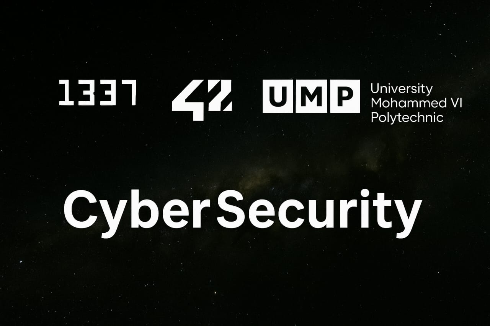

<!-- HEADER -->

  

  🧠 <b>AI Learner</b> • 🛡 <b>Cybersecurity Enthusiast</b> • 🌐 <b>Web Developer</b> • 💻 <b>1337/42 Student</b>

---

## 👋 Welcome to My GitHub Profile

Hi there! I'm **Bilal Taraki**, a passionate **programmer** and **1337/42 Network student**.  
I'm driven by a deep interest in **Cybersecurity**, **Artificial Intelligence**, and **Web Development**,  
while mastering **low-level programming** and **system design** in **C** and **Linux environments**.

> 💡 *"Code with logic, learn with passion, and build with purpose."*

---

## 🧠 Technologies & Skills

### 💬 Languages
`C` • `Python` • `Bash` • `Shell Scripting` • `HTML` • `CSS`

### ⚙️ Systems & Tools
`Linux` • `Unix` • `Git` • `GitHub`

### 🚀 Currently Learning
- Advanced C Programming  
- System & Network Programming  
- AI Fundamentals  
- Cybersecurity Essentials  
- Web Development (HTML, CSS, JS)  
- Git Mastery  

---

## 💻 Tools & Editors I Use

  
  
  
  
  
  
  
  

---

## 📚 42/1337 Projects Progress

| Project | Status |
| :------ | :------ |
| [Libft (42 Project)](https://github.com/btaraki02/libft) |  |

---

## 🌍 Connect with Me

  
  
  

---

  

